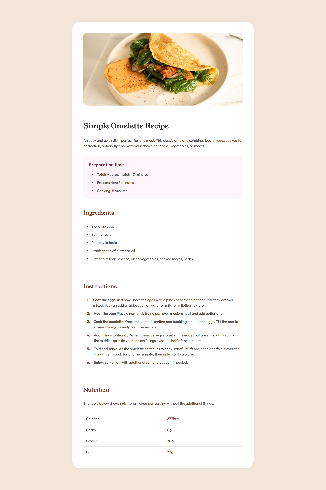

# Frontend Mentor - Recipe Page

Esta é a minha solução para o desafio [Recipe Page](https://www.frontendmentor.io/challenges/recipe-page-KiTsR8QQKm) do Frontend Mentor. O objetivo do projeto foi recriar uma página de receita a partir de um layout fornecido, praticando estruturação semântica com HTML e estilização com CSS.

## Sumário

  - [Visão Geral](#visão-geral)
  - [Screenshot](#screenshot)
  - [Links](#links)
  - [Meu Processo](#meu-processo)
  - [Tecnologias Utilizadas](#tecnologias-utilizadas)
  - [O Que Eu Aprendi](#o-que-eu-aprendi)
  - [Recursos Úteis](#recursos-úteis)

## Visão Geral

Os usuários devem ser capazes de:

- Visualizar a página de receita com um layout agradável em diferentes tamanhos de tela.
- Ler as informações de forma clara e organizada.
- Navegar pelo conteúdo sem perda de legibilidade em dispositivos menores.

### Screenshot



### Links

- Solução URL: [Challenge Recipe Page](https://github.com/nokturnalplague/challenge-recipe-page)
- Live Site URL: [Simple Omelette Recipe](https://nokturnalplague.github.io/challenge-recipe-page/)

## Meu Processo

O projeto foi desenvolvido em uma tarde como forma de praticar conceitos fundamentais de HTML e CSS.

A página foi construída com base na [referência visual do desafio](./design), sem o uso de medidas exatas de um arquivo de design. O layout foi reproduzido manualmente, buscando manter fidelidade à composição, aos espaçamentos e à aparência geral do modelo original.

A estrutura do projeto segue o padrão apresentado no curso [HTML e CSS para Iniciantes da Origamid](https://www.origamid.com/curso/html-e-css-para-iniciantes/), com os arquivos organizados de forma simples, clara e escalável. Os estilos foram separados em múltiplos arquivos, o que facilita a manutenção do código e torna mais simples localizar componentes específicos durante futuras alterações.

Também foi adotada uma abordagem de CSS utilitário, em que propriedades recorrentes, como cores e estilos de fonte, são transformadas em classes reutilizáveis e aplicadas diretamente no HTML. Essa escolha contribui para a padronização visual da interface e torna a construção do layout mais consistente ao longo da página.

### Tecnologias Utilizadas

- HTML5 semântico
- CSS3
- Flexbox
- Pseudo-elementos (`::before`)
- CSS Custom Properties (variáveis CSS)

### O Que Eu Aprendi

Durante o desenvolvimento deste projeto, aprendi uma forma mais flexível de criar listas numeradas personalizadas utilizando recursos nativos do CSS.

Em vez de depender apenas da numeração padrão de uma lista ordenada, utilizei pseudo-elementos em conjunto com CSS counters para controlar melhor a aparência dos números. Para isso, trabalhei com as propriedades:

- `counter-reset`
- `counter-increment`
- `counter()`

Exemplo simplificado:

```css
.instructions ol {
  counter-reset: step;
}

.instructions ol li {
  counter-increment: step;
}

.instructions ol li::before {
  content: counter(step);
}
```

Esse recurso permite criar numerações personalizadas com maior controle visual, mantendo a estrutura do HTML organizada e flexível.

Além disso, o projeto também serviu para praticar a estruturação semântica de conteúdo, a organização de arquivos CSS, a construção de layouts responsivos com Flexbox e o uso de pseudo-elementos para enriquecer a interface.

### Recursos Úteis

- [Usando CSS counters](https://developer.mozilla.org/pt-BR/docs/Web/CSS/Guides/Counter_styles/Using_counters)
